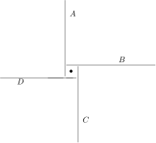
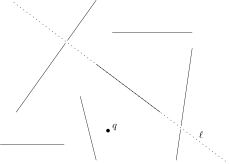

Binary Space Partition Trees

Here are my original [hand-written notes](notes/bsp-trees.pdf) on this topic.

[TOC]

# Sorting Line Segments

The idea of sorting line segments is motivated by the *painter's algorithm* in computer graphics. We first want draw things that are farther from the viewer and then draw things that are closer to the viewer.  This is called *depth sorting*.

For a point $q$, we say that segment $s_1$ is *in front of* segment $s_2$ (with respect to $q$) if there is a ray, $r$, originating at $q$ that hits $s_1$ and then $s_2$. We write this as $s_1\prec_q s_2$.

  

This leads to the following data structures question that we call *scene preprocessing for depth sorting*:

* Input: A set $S$ of $n$ disjoint line segments in the plane
* Problem: Preprocess $S$ so that, for any query point $q$ we can quickly sort the elements of $S$ by the in front of relation

* But this sorting is not always possible, we can have cycles in the $\prec_q$ relation, like $A \prec_q D\prec_q C \prec_q B \prec_q A$.

* In cases like this, we have to cut some of the segments.  For example, we can
cut $A$ into $A_1$ and $A_2$ so that we get $A_1 \prec_q D\prec_q C \prec_q B \prec_q A_2$

# BSP Trees

A BSP tree solves both problems.  It cuts up the input segments so that we can always sort them and it lets us sort quickly.

* Pick a segment $s\in S$ and extend it into a line $\ell$ and store $s$ at the root of the tree
* Cut any line intersected by $\ell$ into two segments (so now every segment is on exactly one side of $\ell$)

* Recursively build BSP trees on the segments to the left of $\ell$ and the segments to the right of $\ell$ and make these the two children of $s$

With a BSP tree, we can depth-sort quickly from any point $q$.  The point $q$ is on one side of the root line $\ell$, say the left side.  Then we we can recursively sort the segments in the left subtree and the recursively sort the segments in the right subtree. Concatenating these two sorted lists gives a valid depth sorting of all the segments, because segments in the right subtree can't possibly be in front of segments in the left subtree.  This take $O(n+k)$ time, where $k$ is the number of times we cut a segment when constructing the BSP tree.  (Each time we cut a segment we get one more node in our BSP tree.)

If we're not careful, we can easily end up with $\Omega(n^2)$ nodes in the BSP tree. (Exercise: come up with an example where this happens using only vertical and horizontal segments)

This is where randomization comes to the rescue.  Define a *random binary space partition tree* as a BSP tree in which the root node is chosen uniformly at random from among all the input segments (and so on, recursively, when constructing the subtrees).

**Theorem:** The expected number of nodes in a random binary space partition tree is $O(n\log n)$

*Proof:* For each segment $s\in S$, define $X_s$ as the number of segments that get cut when we extend $s$.  Then the quantity we're studying is
\[
   \E[k] = \E\left[\sum_{s\in S} X_i\right] = \sum_{s\in S}\E[X_s] \enspace .
\]
So let's focus on a particular $s\in S$.  There are some segments in $S$ that cross the line that we get by extending $s$; these are the segments that might be cut when we extend $s$. Call these $a_1,\ldots,a_k$ and $b_1,\ldots,b_{k'}$ as in the figure below:

Now, define the indicator variables
\[
     A_i = \begin{cases}1 & \text{if $a_i$ get cut by $s$} \\ 0 &\text{otherwise.}  \end{cases}
\]
and
\[
     B_i = \begin{cases}1 & \text{if $a_i$ get cut by $s$} \\ 0 &\text{otherwise.}  \end{cases}
\]
So now we have
\[
     \E[X_s] = \E\left[\sum_{i=1}^k A_i +  \sum_{i=1}^{k'} B_i\right]
        = \sum_{i=1}^k \E[A_i] +  \sum_{i=1}^{k'} \E[B_i]  \enspace .
\]
When can $s$ cut $a_i$?  This happens when we are building a subtree that includes
$s$ and $a_1,\ldots,a_i$ and we pick $s$ as the root of that subtree.  We could also have picked any of $a_1,\ldots,a_i$, so the probability that this happens is
\[
    \Pr\{\text{$s$ cuts $a_i$}\} \le \Pr\{A_i=1\} = \E[A_i] = 1/(i+1) \enspace .
\]
By the same argument, $\E[B_i] = 1/(i+1)$.  Now we can determine $\E[X_s]$ with
\begin{align}
   \E[X_s] & = \sum_{i=1}^k \E[A_i] +  \sum_{i=1}^{k'} \E[B_i] \notag \\
       & \le \sum_{i=1}^k 1/(i+1) +  \sum_{i=1}^{k'} (1/i+1) \notag \\
       & = \sum_{i=1}^n 1/(i+1) +  \sum_{i=1}^{n'} (1/i+1) \notag \\
       & = 2H_n - 2 \le 2 \ln n \enspace .
\end{align}
The last line and the inequality there refer to the harmonic numbers discussed at the end  of [the first lecture](prob-review.html).  Finally, summing over all $s$ gives
\[
   \E[k] = \sum_{s\in S}\E[X_s] \le 2n\ln n \enspace
\]
and we're done.  &#8718;

# Discussion

BSP trees are used in *ray tracing* (movie quality computer graphics), computer-assisted design software, and manufacturing, and other areas.

BSP trees were instrumental in making the original DOOM game run beautifully on early 90's computer hardware.

This made [id Software](http://www.idsoftware.com/en-us) enormously successful so they could later bring us Wolfenstein 3D, Quake, Rage, Orcs and Elves, &hellip;
