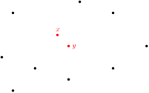
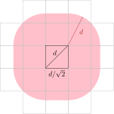

Closest Pair and Linear Programming

This lecture looks at two randomized algorithms for two geometric problems.  Both algorithms are *randomized incremental algorithms*: They each compute a random permutation of the input and then incrementally solve the problem by adding one input element at a time and updating the current solution after the addition of each element.

[TOC]

# Closest Pair

* Let $P$ be a set of $n$ points in $\R^2$
* We want to find a *closest pair* in $P$ that is, a pair of points $\{a,b\}\subset P$
  such that the distance between $a$ and $b$ is minimum over all pairs of points in $P$
  

  
  

* The obvious algorithm checks all $\binom{n}{2}$ pairs and runs in $\Theta(n^2)$ time.

For simplicity, we will assume that all inter-point distances are unique, so there are no ties.  Recall that a *hash table* can store a set of key/value pairs so that, we can test if any key is in the set and look up its value in $O(1)$ expected time.

We will solve the closest-pair problem with this randomized incremental algorithm:

* Take a random permutation of the points of $P$; call this $(p_1),\ldots,(p_n)$,
  where $p_i=(x_i,y_i)$
* The algorithms will keep track of the closest pair among all $p_1,\ldots,p_i$.
* The algorithm uses a hash table whose keys are pairs of integers to store $p_1,\ldots,p_i$
* Let $d^\star$ be the distance between closest pair among $p_1,\ldots,p_i$ (the closest pair found so far)
* A point with coordinates $(x,y)$ is stored at table location
  \[ K(x,y) = (\lfloor x\sqrt{2}/d^\star \rfloor, \lfloor y\sqrt{2}/d^\star\rfloor) \]
* Notice that there is only one point stored in each table location (since two points in the same table location have distance less than $d^\star$)
* To add a new point $p_{i+1}$, we compute it's table location $K(x_{i+1},y_{i+1})=(k,\ell)$; and we look at table locations $(k\pm 2,\ell\pm 2)$

* If $p_{i+1}$ is part of a new closest pair, then we update $d^\star$, and rebuild our hash table with this new value of $d^\star$ in $O(i)$ time.

**Lemma:** The probability that $p_{i}$ is part of the closest pair among $p_1,\ldots,p_i$ is at most $2/i$.

*Proof:* Remember that $p_1,\ldots,p_n$ is a random permutation of $P$, so $p_1,\ldots,p_i$ is a random permutation of $P_i=\{p_1,\ldots,p_i\}$.  Exactly two elements $a$ and $b$ of $P_i$ define the closest pair and $p_i$ is equally likely to be any of the $i$ elements of $P_i$ so the probability that $p_i\in\{a,b\}$ is $2/i$. &#8718;

**Theorem:** Given a set of $n$ points in $\R^2$, we can find the closest pair in $O(n)$ expected time

*Proof:* After computing the random permutation, the rest of the algorithm examines each point, does a constant number of work, and possibly rebuilds the hash table.  Let $c>0$ be some constant and for each $i\in\{2,\ldots,n\}$, let  
\[
    I_i = \begin{cases} ci & \text{if $p_i$ is part of the CP of $p_1,\ldots,p_i$} \\
                       0 & \text{otherwise .} \end{cases}
\]
Exercise: Check that $\E[I_i] \le 2c$.
Then, the expected amount of time spent rebuilding hash tables is
\[
  \E\left[\sum_{i=2}^n I_i\right]
  = \sum_{i=2}^n \E[I_i]
  = \sum_{i=2}^n 2c
  = \sum_{i=2}^n O(1) = O(n) \enspace .
\]
The other steps of the algorithm easily run in $O(n)$ time.  If you're not sure how the random permutation is generated, you can read about the [Fisher–Yates Shuffle](https://en.wikipedia.org/wiki/Fisher%E2%80%93Yates_shuffle). &#8718;

The preceding algorithm easily generalizes to points in $\R^{d}$, though the expected running time becomes $O(C^d n)$ for some constant $C$.  So the algorithm is linear in $n$ but exponential in $d$. This is pretty common for geometric problems and is sometimes called the *curse of dimensionality*.

# Linear Programming

* We are give a set $L$ of $n$ lines in $\R^2$ and we want to find the lowest point that is above all the lines. (Think of dropping a marble on to the set of lines. Where does it roll to?)

* We can check that there is at least one line with positive slope and one line with negative slope (otherwise the program is *unbounded*, the marble rolls away forever)
* Trivial algorithm checks every pair of line intersections in $\Theta(n^3)$ time (we have to check if each intersection is above all the lines)

**Exercise:**  How much better can you do than the trivial algorithm? $O(n^2)$, $O(n\log n)$?

To make life simple, we assume there are no horizontal lines and no three lines interect in a common point. We can solve this problem again with a randomized incremental algorithm.

* Let $\ell_1$ and $\ell_2$ be a line with negative slope and a line with positive slope
  and let $p^\star$ be their intersection point
* $\ell_3,\ldots,\ell_n$ is a random permutation of the remaining $n-2$ lines.
* When considering $\ell_i$, one of two things happens:
    1. $\ell_i$ is below $p^\star$ in which case we do nothing
    2. $\ell_i$ is above $p^\star$ in which case the new solution involves $\ell_i$
       and we can find it in $O(i)$ time

This should look familiar.  All we need to show now is that the new solution is not likely to involve $\ell_i$.  Exactly 2 lines in $\ell_1,\ldots,\ell_i$ define the optimal solution for $\ell_1,\ldots,\ell_i$.  Now, $\ell_i$ is uniformly chosen from a set of size $i-2$, so the probability that $\ell_i$ is one of the two that defines the solution is at most $2/(i-2)$.  The rest of the analysis is just like the analysis of the closest pair algorithm.

**Theorem:** Given $n$ lines in $\R^2$, we can find the lowest point that is above all the lines in $O(n)$ expected time.

The preceding algorithm also generalizes to $\R^d$, and again, the expected running-time is $O(C^dn)$ for some constant $C$.  The generalization is less straightforward, though, and involves a recursion on the dimension, $d$.
