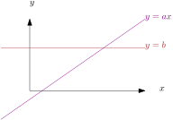

Fingerprinting

Here we look at a family of algorithmic techniques collectively called *fingerprinting*.

[TOC]

# Freivald's Algorithm

Remember the obvious $\Theta(n^3)$ algorithm for multiplying two $n\times n$ matrices, $A$ and $B$:

    Multiply(A, B, n)
      for i = 1 to n
        for j = 1 to n
          C[i][j] = 0
          for k = 1 to n
            C[i][j] = C[i][j] + A[i][k]*B[k][j]

Suppose, instead that someone gives us three $n\times n$ matrices $A$, $B$, and $C$ and claims that
\[
   A \times B = C \enspace.
\]
How can we verify that this is true?

* The obvious thing to do is to compute $A\times B$ ourselves and check if the
  result is correct
* The obvious matrix-multiplication algorithm takes $\Theta(n^3)$ time.
* Even the fastest (very complicated) algorithms take $\Theta(n^\omega)$ time where $\omega\approx 2.3728639$
* We want to do this in optimal $\Theta(n^2)$ time

The first thing to remember is that, for fixed $a,b\in\R$, $a\neq 0$, the equation $ax=b$ has exactly one solution for $x$ (namely $x=b/a$).

Recall that the *dot product* of two vectors $v=(v_1,\ldots,v_n)$ and $w=(w_1,\ldots,w_n)$
is
\[
    v\cdot w = \sum_{i=1}^n v_i\times w_i \enspace .
\]

**Fingerprint Lemma:** Let $v=(v_1,\ldots,v_n)$ and $w=(w_1,\ldots,w_n)$ be two real-valued vectors with $v\neq w$,
and let $r=(r_1,\ldots,r_n)$ be a vector whose values are integers chosen uniformly and independently at random from ${1,\ldots,K}$.  Then
\[
    \Pr\{r\cdot v = r\cdot w\} \le 1/K \enspace .
\]

*Proof:* Since $v\neq w$, there is at least one index $k$ such that $v_i\neq w_i$. Now,
rewrite $r\cdot v = r\cdot w$ as
\[
    r_i(v_i-w_i) = \sum_{j\neq i} r_j(w_j - v_j) \enspace .
\]
With everything on the right-hand-side fixed, there is only one value of $r_i$
that satisfies this equation.  namely
\[
   r_i' = \frac{\sum_{j\neq i} r_j(w_j - v_j)}{v_i-w_i}
\]
But $r_i$ is chosen randomly from among $K$ different values, so the probability that $r_i=r_i'$ is at most $1/K$. &#8718;

We can think of $r\cdot v$ and $r\cdot w$ as the *fingerprints* of $v$ and $w$; they are small quantities (a single number) that is almost surely different if $v$ and $w$ are different.

Remember that we can multiply an $n$-vector $r$ by and $n\times n$ matrix $A$
in $O(n^2)$ time.  You can read the code right off the formula for vector-matrix matrix-multiplication:  If $x = rA$, then
\[
    x_i = \sum_{j=1}^n r_j A_{i,j}
\]

    :::pseudocode
    for i = 1 to n
      x[i] = 0
      for j = 1 to n
        x[i] = x[i] + r[j]*A[i][j]

The result of this multiplication is another $n$-vector.  That means we can compute
$r\times A\times B$ in $O(n^2)$ time; first compute $v=rA$ and then compute $vB=rAB$.  We can also compute $rC$ in $O(n^2)$ time.
Clearly, if $A\times B = C$, then $r\times A \times B = r\times C$.

**Lemma:** If $A\times B\neq C$, and a $r$ is chosen as above, then
\[
    \Pr\{rAB = rC\} \le 1/K
\]

*Proof:*  Let $X=AB$.  Then, since $X\neq C$, there must be some indices $i$ and $j$
such that $X_{i,j} \neq C_{i,j}$.  In particular, column $j$ of $X$ is not equal to column $j$ of $C$. But $(rX)_i$
is just the dot product of $r$ and column $j$ of $X$ and $(rC)_i$ is the dot product of column $j$ of $C$ with $r$.  Therefore, by the fingerprint lemma $\Pr\{(rAB)_i = (rC)_i\} \le 1/K$.  &#8718;

To summarize, we have an algorithm (*Freivald's Algorithm*) that runs in $\Theta(n^2)$ time and, given three $n\times n$ matrices $A$, $B$, and $C$ will:

* always return `true` if $A\times B=C$;
* return `false` with probability at least $1-1/k$ if $A\times B\neq C$

# String Matching

Suppose we have a little string $p=p_0,\ldots,p_{m-1}$ and a big body of text $t=t_0,\ldots,t_{n-1}$.  Here $m<n$ and we want to look for occurrences of $p$ in $t$.
More precisely,

* A *match* is an index $i$ such that $p_j = t_{i+j}$ for all $j\in\{0,\ldots,m-1\}$

We want to find the first match or all matches.  The obvious algorithm looks like this:

    :::pseudocode
    for i = 0 to n-m
        j = 0
        while j < m and p[j] = t[i+j]
            j = j + 1
        if j == m then output i

This algorithm finds all matches and runs in $O(nm)$ time, and on some instances it runs in $\Omega(nm)$ time, even when there are no matches to output. This happens, for example, when $p=aaaa\ldots aab$ and $t=aaaa\ldots a$.

## Kalai's algorithm

Note that we can think of $p$ and $t$ as sequences of integers in the range ${0,\ldots,k-1}$ where $k$ is the alphabet size. Notice that, if we have a random vector $r\in\{1,\ldots,K\}^n$ of length $m$ then, by the Fingerprint Lemma, if $i$
is not a match, then
\[ \Pr\{ r\cdot p = r\cdot (t_{i},\ldots,t_{i+m-1}) \} \le 1/K \enspace . \]

We can compute $r\cdot t$ in $O(m)$ time.  Now, if we can compute $r\cdot (t_{i},\ldots,t_{i+m-1})$ for all $i\in\{1,\ldots,n-m\}$, then we have an efficient string matching algorithm.  This kind of calculation is called the *convolution* of $r$ and $t$.  It can be done in $O(n\log n)$ time using the Fast-Fourier Transform (which we may discuss later in the course.)

This means that we have an algorithm that runs in $O(n\log n)$ time and returns a list of integers $L$ such that
1. If $i$ is a match, then $i$ is in $L$.
2. If $i$ is not a match, then $\Pr\{i\in L\} \le 1/K$.

That's already impressive, what even more impressive is that this algorithm can also easily handle *wildcards*; these are locations in $p$ that match any character.  For example, we may have a pattern like "p?st" that matches "past", "post", and "pest". This extension is trivial: At any index where the pattern has a wildcard, we just set the corresponding value in $r$ to zero.  Then this character will not contribute to the fingerprint $r\cdot p$ or to $r\cdot (t_i,\ldots,t_{i+m-1})$.

**Theorem:** Given a pattern string $p$ of length $m$, possibly with wildcards and a text string, $t$ of length $n$, there is an algorithm that runs in $O(n\log n)$ time and returns a list of integers $L$ such that
1. If $i$ is a match, then $i$ is in $L$.
2. If $i$ is not a match, then $\Pr\{i\in L\} \le 1/K$.

Of course, if we take $K \ge m$, then we can even verify each value of $i$ $O(m)$ time and to see if it really is a match.  The expected amount of time we will spend on non-matches is only $O(n)$.  [Exercise: write this down carefully.]

## The Rabin-Karp Algorithm

Here are my [original hand-written notes](notes/strings/) on this topic.  Here's the [algorithm implemented in C](http://cglab.ca/~morin/teaching/4804-old/notes/stringmatch.c).

Now we can think of $p$ and $t$ as sequences of integers in the range ${0,\ldots,k-1}$ where $k$ is the alphabet size.  We can compress $p$ down to think of $p$ as a a single integer
\[
    I(p) = \sum_{j=0}^{m-1} k^{m-j-1}\times p_j
\]
Just think of $p$ as a base-$k$ representation of some integer. For example if our alphabet is $0,1,2,3,4,5,6,7,8,9$ and $p="10393"$, then $I(p)=10393$.  We can compute $I(p)$ in $O(m)$ time:

    :::pseudocode
    x = 1
    I = 0
    for j = 0 to m-1
        I += p[m-j-1]*x
        x = x*k

We can restate our problem as that of trying to find the indices $i$ where
\[
   I(p) = I(t_i\ldots,t_{i+m-1}) \enspace .
\]

The nice thing about this is that we only need to compute $I(p)$ once and we have a nice relation between consecutive strings in $t$:
\[
   I(t_{i+1},\ldots,t_{i+m}) = kI(t_i,\ldots,t_{m-1}) - t_{i}k^m + t_{i+m}
\]

    :::pseudocode
    Ip = I(p)
    Ir = I(t[0...m-1])
    km = k to the power m
    for i = 0 to n-m
        if Ip == Ir then output i
        Ir = k*Ir - t[i]*km + t[i+m]

Great! This looks like a linear time algorithm.  There's only one problem; the values of Ip and Ir are *huge*.  We can't store them in a single machine register, so those multiplications and additions each take (at least) $\Omega(m)$ time.  We need to make things smaller still.

### Number Theory to the Rescue

To do this, we're going to pick a prime number $P$ and do all our arithmetic modulo $P$, so all the numbers we deal with are in the range ${0,\ldots,P-1}$.  If $P$ is small enough to fit into a register, then the algorithm definitely runs in $O(n)$ time, but is it correct?  Not always: just because
\[
   I(p)\bmod P = I(t_i,\ldots,t_{i+m-1}) \bmod P
\]
doesn't mean $I(P)=I(t_i,\ldots,t_{i+m-1})$.

We're going to make sure that it's *probably works most of the time*.  The statement
\[
   x \bmod P = y \bmod P
\]
really means $x=aP + b$ and $y=a'P + b$, for some integers $a$, $a'$ and $b$.  This means
\[
      x-y = (a-a')P
\]
So we have to worry about the case where $x-y$ is a multiple of $P$.  This only happens when $P$ is a prime factor of $|x-y|$.  How many prime factors does $x-y$ have?  Each prime factor is at least $2$, so if $|x-y|$ has $q$ prime factors, then $|x-y| \ge 2^q$.  This means $q \le \log_2|x-y|$.  So $|x-y|$ has at most $\log_2|x-y|$ prime factors.

Now our $x$'s and $y$'s are integers in the range $\{0,\ldots,k^m\}$, so there are only $m\log_2 k$ prime factors we have to worry about.  Now we need a result from number theory:

**Theorem:** The number of primes less than $N$ is about $N/\ln N$.

Hey, that a lot primes! We can use this:

**Lemma:** If $P$ is a prime number chosen uniformly at random the set of all
 primes less than $N$ and $I(p) \neq I(t_{i},\ldots,t_{i+m-1})$ , then
 \[
     \Pr\{I(p)\bmod P = I(t_{i},\ldots,t_{i+m-1})\bmod P \} \le \frac{m\ln N\log_2 k}{N}
 \]

*Proof:* We've already given it.  We have $N/\ln N$ choices for $P$ and there are at most $m\log_2 k$ that cause $I(p)\bmod P = I(t_{i},\ldots,t_{i+m-1})\bmod P$.  &#8718;

How big do we need $N$ to be?  If we take $N > 2Q m\log m\log k$, then the probability in the lemma becomes at most $1/Q$.  Usually, we would take $N$ to be about as big as we could comfortably fit into a machine word $N=2^{32}$ or $N=2^{64}$.  Here's the [whole thing in C](http://cglab.ca/~morin/teaching/4804/notes/stringmatch.c).

# Primality Testing

If we want to test if a number $P$ is prime, we can use a bit of number theory.  Write $P-1$ as $2^s d$ for integer $s$ and odd $d$.  Now, if $P$ is prime, then for every $a\in\{1,\ldots,P-1\}$,

* $a^d \equiv 1\pmod P$; or
* $a^{2rd} \equiv -1 \pmod P$, for some $r\in\{0,\ldots,s-1\}$.

On the other hand, if $P$ is not prime, then for at least half the values of $a\in\{1,\ldots,P-1\}$,

* $a^d \not\equiv 1\pmod P$; or
* $a^{2rd} \not\equiv -1 \pmod P$, for all $r\in\{0,\ldots,s-1\}$.

So the test is easy. We pick a random $a$ and check if the first or second case holds. In the case when $P$ is not prime, we will correctly detect it with probability at least $1/2$.  If we want to be more certain, then we can repeat the experiment $k$ times and we will correctly detect composites with probability at least $1-2^{-k}$.
