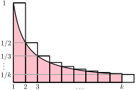

# Review of basic probability

Here are my original [hand-written notes](notes/prob/) on this topic.

## Probability function

* Let $U$ (the universe) be some set
* A *probability function* $\Pr\colon 2^U\to [0,1]$ has the following properties:
    1. $\Pr\{A\} \ge 0$ for all $A\subseteq U$
    1. $\Pr\{U\} = 1$
    1. $\Pr\{A \cup B\} = \Pr\{A\} + \Pr\{B\}$ whenever $A$ and $B$ are disjoint

In general $\Pr\{A\cup B\} = \Pr\{A\} + \Pr\{B\} - \Pr\{A\cap B\}$ because
the first two terms count $\Pr\{A\cap B\}$ twice

this is called the *inclusion-exclusion formula*.  We immediately get *Boole's Inequality*:
\[
   \Pr\{A \cup B\} \le \Pr\{A\} + \Pr\{B\} \enspace.
\]
Boole's Inequality is also called the *union bound*.

## Some terminology

* $A$ and $B$ are called *events*
* If $|A|=1$, then it is called an *elementary event*
* $\Pr\{A\cup B\}$ is also called $\Pr\{\text{$A$ or $B$}\}$
* $\Pr\{A\cap B\}$ is also called $\Pr\{\text{$A$ and $B$}\}$

## Examples

* Coin toss: $U=\{H, T\}$ and $\Pr\{H\} = \Pr\{T\} = 1/2$
* Die toss (6-sided): $U=\{1,2,3,4,5,6\}$ and $\Pr\{i\} = 1/6$ for each
     $i\in\{1,\ldots,6\}$.
* Tossing 2 coins (one silver and one gold): $U=\{TT, TH, HT, HH\}$ and
   $\Pr\{TT\}=\Pr\{TH\}=\Pr\{HT\}=\Pr\{HH\}=1/4$
* Rolling two dices (one blue and one red): $U=\{(i,j):i,j\in\{1,\ldots,6\}$ and
  $\Pr\{(i,j)\} = 1/36$ for all $i,j\in\{1,\ldots,6\}$
* Rolling two dice and taking their sum:
  \[  U = \{2,3,4,5,6,7,8,9,10,11,12\} \]
    * $\Pr\{2\} = \Pr\{(1,1)\} = 1/36$.
    * $\Pr\{3\} = \Pr\{(1,2)\} + \Pr\{(2,1)\} = 2/36$
    * $\Pr\{4\} = \Pr\{(1,3)\} + \Pr\{(3,1)\} + \Pr\{(2,2)\} = 3/36$
    * $\Pr\{5\} = \Pr\{(1,4)\} + \Pr\{(4,1)\} + \Pr\{(2,3)\} + \Pr\{(3,2)\} = 4/36$
    * $\Pr\{6\} = \Pr\{(1,5)\} + \Pr\{(5,1)\} + \Pr\{(2,4)\} + \Pr\{(4,2)\} + \Pr\{(3,3)\} = 5/36$
    * $\Pr\{7\} = \Pr\{1,6\} + \Pr\{(6,1)\} + \cdots + \Pr\{(3,4)\} + \Pr\{(4,3)\} = 6/36 = 1/36$
    * $\Pr\{8\}=5/36$
    * $\Pr\{9\}=4/36$
    * $\Pr\{10\}=3/36$
    * $\Pr\{11\}=2/36$
    * $\Pr\{12\}=1/36$

## Calculating some probabilities

* Roll a die, what is the probability of getting an even number?
  \[\Pr\{2,4,6\} = \Pr\{2\} + \Pr\{4\} + \Pr\{6\} = 3/6 = 1/2\]
  This uses Property 3 of probability spaces. For countable $U$, we
  can always use $\Pr\{A\}=\sum_{x\in A} \Pr\{x\}$
* Pick a number, $x$, uniformly at random from $\{1,\ldots,1000\}$ (so $\Pr\{i\}=1/1000$ for all $i\in\{1,\ldots,1000\}$).  What is the probabilty that $x$ is divisible by 2 or 3?  Using the notation "$a\mid x$" to mean "$x$ is divisible by $a$", we have:
  \begin{align} \Pr\{\text{$2\mid x$ or $3\mid x$}\} &
     = \Pr\{2\mid x\} + \Pr\{3\mid x\} - \Pr\{6\mid x\} \notag \\
     & = \frac{500}{1000}+\frac{333}{1000}-\frac{166}{1000} \notag \\
     & =\frac{667}{1000} \notag
  \end{align}
  Here we used the inclusion-exclusion formula.
 * Roll two dice, what is the probability that their sum is even?
 \begin{align}
   \Pr\{\text{$i+j$ is even}\}  
    & = \Pr\{\text{$i$ and $j$ are both even}\}
         + \Pr\{\text{$i$ and $j$ are both odd}\} \\
    & = \frac{3\times 3}{36} + \frac{3\times 3}{36} \\
    & = \frac{1}{2}   
  \end{align}
  This used Property 3 again, since a number can't be both even and odd.
* Roll two dice, what is the probability that their sum is odd?
  \[\Pr\{2\not\mid (i+1)\} = 1-\Pr\{2\mid (i+j)\} = 1-1/2 = 1/2  \]
  This is a very common trick for computing the probabilities of *complementary
  events*.  If we know $\Pr\{A\}$, then we know
  that $\Pr\{\overline{A}\} = \Pr\{U\setminus A\} = 1-\Pr\{A\}$.

## Expectation and Random Variables
* Let $X\colon U\to \R$ map each element of $U$ to a real number
* The *expected value* of $X$ is
  \[ \sum_{a\in U}\Pr\{a\}\times X(a) \]
* Example: Roll a die.  Define $X(i)=i$ and we get
  \[ \E[X] = \frac{1}{6}\times 1
           + \frac{1}{6}\times 2  
           + \frac{1}{6}\times 3
           + \frac{1}{6}\times 4
           + \frac{1}{6}\times 5
           + \frac{1}{6}\times 6 = 3.5
  \]
  The expected value is $3.5$.
* Example: Sum of two dice.  Define $X(i,j)=i+j$.  then
  \begin{align}
    \E[X] & =  2\times\frac{1}{36}
            +3\times\frac{2}{36}
            +4\times\frac{3}{36}
            +5\times\frac{4}{36}
            +6\times\frac{5}{36}
            +7\times\frac{6}{36} \notag \\
          &\quad{}+8\times\frac{5}{36}
            +9\times\frac{4}{36}
            +10\times\frac{3}{36}
            +11\times\frac{2}{36}
            +12\times\frac{1}{36} \notag \\
          & = \cdots \notag \\
          & = 7 \notag
  \end{align}

## Linearity of Expectation

* For any random variables $X$ and $Y$,
\[ \E[X+Y] = \E[X] + \E[Y] \]
* This is so useful, it has a name: *linearity of expectation*
* Example: Sum of two dice, $D_1$ and $D_2$, (again)
\[ \E[D_1+D_2] = \E[D_1] + \E[D_2] = 3.5 + 3.5 = 7 \]
* Example: Toss $n$ coins, what is the expected number of heads?
Define
\[  X_i = \begin{cases}
       1 & \text{if $i$th coin comes up heads}\\
       0 & \text{otherwise}   
      \end{cases}
\]
Then
\begin{align}
   \E[X_1+\cdots X_n]
      & = \E[X_1] + \cdots \E[X_n] \notag \\
      & = \Pr\{\text{first coin is heads}\}\times 1
          + \Pr\{\text{first coin is tails}\}\times 0 +{} \notag \\
          & \quad \cdots + \Pr\{\text{$n$th coin is heads}\}\times 1
          + \Pr\{\text{$n$th coin is tails}\}\times 0  \notag \\
      & = \frac{1}{2}\times 1 + \frac{1}{2}\times 0 + \cdots
          + \frac{1}{2}\times 1 + \frac{1}{2}\times 0 \notag \\
      & = n/2 \notag
\end{align}
The 0/1 valued $X_i$ are called *Bernoulli* or *indicator* random variables.

If you're interested in a proof of linearity of expectation, here it is:
\begin{align}
   \E[X+Y] & = \sum_{x}\sum_y (x+y)\Pr\{\text{$X=x$ and $Y=y$}\} \notag \\
           & = \sum_{x}\sum_y x\Pr\{\text{$X=x$ and $Y=y$}\}
             + \sum_{x}\sum_y y\Pr\{\text{$X=x$ and $Y=y$}\} \notag  \\
           & = \sum_{x}\sum_y x\Pr\{\text{$X=x$ and $Y=y$}\}
             + \sum_y\sum_{x} y\Pr\{\text{$X=x$ and $Y=y$}\} \notag  \\
          & = \sum_{x}x\sum_y \Pr\{\text{$X=x$ and $Y=y$}\}
             + \sum_y y\sum_{x} \Pr\{\text{$X=x$ and $Y=y$}\} \notag  \\
           & = \sum_{x} x\Pr\{\text{$X=x$}\}
             + \sum_y\Pr\{\text{$Y=y$}\} \notag  \\
          & = \E[X] + \E[Y] \notag
\end{align}
Not very enlightening.  The key step is where the number of summation symbols goes from 4 down to 2.  This is possible, because when we sum, over all $y$, $\Pr\{\text{$X=x$ and $Y=y$}\}$ we get $\Pr\{X=x\}$.  The Venn diagram below shows an example of this.  Here the event $X=x$ is shown as a pink circle. The different possible values of $Y$ are shown as blobs and they have to cover the pink circle because they cover all of $U$.

## More Indicator Variable Examples

Indicator variables, along with linearity of expectation are an extremely
efficient way of computing expected values.

### Balls in Urns

Throw $n$ balls into $m$ urns in such a way that each ball is equally likely to land in any urn.  (Exercise: Check, using the definition of a probability function, that this implies $\Pr\{\text{ball $i$ lands in urn 1}\}=1/m$).  What is the expected number of balls in the first urn?

Define
\[
    I_i = \begin{cases} 1 & \text{if ball $i$ lands in urn 1} \\
                        0 & \text{otherwise} \end{cases}
\]
Then
\[
    \E[I_i] = \Pr\{\text{ball $i$ lands in urn 1}\}\times 1 = 1/m
\]
So
\[
    \E[I_1+\cdots I_n] = \E[I_i] + \cdots \E[I_n] = n/m
\]
Done.

### Records

Take a random permutation $x_1,\ldots,x_n$ of $1,\ldots, n$. Call $x_i$ a *record* if $x_i=\max\{x_1,\ldots,x_i\}$.  What is the expected number of records?

Define
\[
    I_i = \begin{cases} 1 & \text{if $x_i=\max\{x_1,\ldots,x_i\}$} \\
                        0 & \text{otherwise} \end{cases}
\]
The largest value among $x_1,\ldots,x_i$ is equally likely to be any of $x_1,\ldots,x_i$, so $\Pr\{x_i=\max\{x_1,\ldots,x_i\}\} = 1/i$.  So,
\[
    \E[I_i] = 1/i
\]
So, the expected number of records is
\[
    \E[I_i+\cdots+I_n] = \E[I_i] + \cdots \E[I_n] = 1 + 1/2 + 1/3+\cdots 1/n
\]
The sum $1+1/2+\cdots 1/n$ is called the $n$th *harmonic number*, $H_n$. Using
the fact that $\int_1^n 1/x\,dx = \ln n$, We can
easily show that $\ln n \le H_n \le \ln n+1$:

