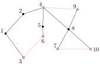

Approximations for the TSP

Imagine we have a travelling salesman who starts in some city and has to visit each of $n-1$ other cities (to sell something in each one) and return home.  He wants to do this tour with as little cost as possible. Here, cost might be travel time, gasoline, electricity, you name it.

# The Metric Travelling Salesman problem

The input is an $n\times n$ distance matrix $d$ where $d_{i,j}$ denotes the *cost* of travelling from city $i$ to city $j$.  This matrix defines *metric*:

2. $d_{i,j}\ge 0$ for all $i,j\in\{1,\ldots,n\}$ (non-negative)
1. $d_{i,i} = 0$ for all $i\in\{1,\ldots,n\}$
3. $d_{i,j}=d_{j,i}$ for all $i,j\in\{1,\ldots,n\}$ (symmetric)
4. $d_{i,k}\le d_{i,j} + d_{j,k}$ for all $i,j,k\in\{1,\ldots,n\}$ (triangle inequality)

The goal is to find a permutation $\pi=\pi_1,\ldots,\pi_n$ of $1,\ldots,n$ that minimizes the function
\[
   w(\pi) = \sum_{i=1}^{n-1}d_{\pi_i,\pi_{i+1}} + d_{\pi_n,\pi_1} \enspace .
\]

# An Approximation Based on the Minimum Spanning Trees

We can think of $d$ as a complete weighted graph $G$ whose vertex set is $V=\{1,\ldots,n\}$ and for which the weight of the edge $ij$ is $d_{i,j}$.  We can compute the minimum spanning tree of this graph in $O(n^2)$ time using an old [algorithm of Borůvka](https://en.wikipedia.org/wiki/Bor%C5%AFvka's_algorithm).

Let $T$ be this minimum spanning tree and imagine performing a traversal of $T$ and recording the list of vertices as we encounter them.  This gives us a list of vertices in which the number of times a particular vertex $v$ appears is equal to its degree, $\deg(v)$.

In this example, we obtain the sequence
\[
  S_1 = 1, 3, 1, 2, 4, 5, 6, 5, 4, 8, 7, 8, 10, 8, 9, 8, 4, 2, 1 \enspace .
\]
Now, remove all but the first occurence of each vertex in his sequence (except 1):
\[
  S_2 = 1, 3, 2, 4, 5, 6, 8, 7, 10, 9, \enspace .
\]

Note that $S_2$ is a permutation of $\{1,\ldots,n\}$ since $S_1$ contains every element of $\{1,\ldots,n\}$ at least once and therefore $S_2$ contains every element exactly once.  Therefore, $S_2$ is a valid solution for the Travelling Salesman Problem.  How good is it?

Each edge of T is used exactly twice $S_1$, so
\[   w(S_1) = 2w(T) \enspace . \]
By the triangle inequality
\[
     w(S_2) \le w(S_1) \enspace .
\]
Remember that $T$ is a *minimum spanning tree*; it's a minimum weight connected subgraph of $G$.  But a travelling salesman tour is also a connected subgraph of $G$, so
\[
     w(T) \le w(C^\star) \enspace ,
\]
where $C^\star$ is any optimal travelling salesman tour.  Putting all these together, we have
\[
     w(S_2) \le w(S_1) \le 2w(T) \le 2w(C^\star) \enspace .
\]
We have just found a solution, $S_2$, to the travelling salesman problem whose weight is at most twice that of the optimal solution.

**Theorem:** There is an $O(n^2)$ time algoritm that solves produces a solution to the travelling salesman problem whose cost is at most twice that of an optimal solution.

# Christofides' algorithm

We can think of the preceding algorithm as starting with the minimum spanning tree $T$ and then doubling each edge of $T$ to obtain another (non-simple) graph $T'$.  The degree of each vertex in $T'$ is double its degree in $T$.  In particular, the degree of each vertex is even.  This means that $T'$ is *Eulerian*, there is a closed walk in $T'$ that crosses every each of $T'$ exactly once. It's this walk that we use to make $S_1$ and the weight of this walk is, of course, $2w(T)$ because it uses each edge of $T$ twice.

But there's a better way to make $T$ Eulerian.  Let $V'$ be the set of $T$'s odd degree vertices.  Convince yourself that $|V'|$ is even.  Now, group the vertices of $V'$ into pairs and. for each pair, add an edge between them to obtain a new graph $T''$.  Call this set of $|V'|/2$ edges $M$ (for matching).  Now $T''$ is also Eulerian, so there is a closed walk that crosses each of edges exactly once.

This means that we have found a solution to the travelling salesman problem whose cost is
\[
     w(T) + w(M)
\]
We already know that $w(T)\le w(C^\star)$.  For $M$, we rely on an algorithm for the *minimum weight perfect matching* problem, which runs in $O(n^3)$ time.  Still, we need to relate $w(M)$ to $w(C^\star)$.  To do this, connect the vertices in $V'$ into a cycle, $C$, in the order they appear in $C^\star$.  By the triangle inequality $w(C) \le w(C^\star)$.  What's more, $C$ can be partitioned into two perfect matching by alternately coloring its edges red and blue. One of these two matchings has weight at most  $w(C)/2$.  Now $M$ is a minimum weight perfect matching of $V'$, so
\[
    w(M) \le w(C)/2 \le w(C^\star)/2 \enspace .
\]
And that's it, the solution we've found has weight
\[
   w(T) + w(M) \le w(C^\star) + w(C^\star)/2 = \frac{3}{2}w(C^\star)
\]

**Theorem:** There is an $O(n^3)$ time algoritm that solves produces a solution to the travelling salesman problem whose cost is at most $3/2$ that of an optimal solution.
